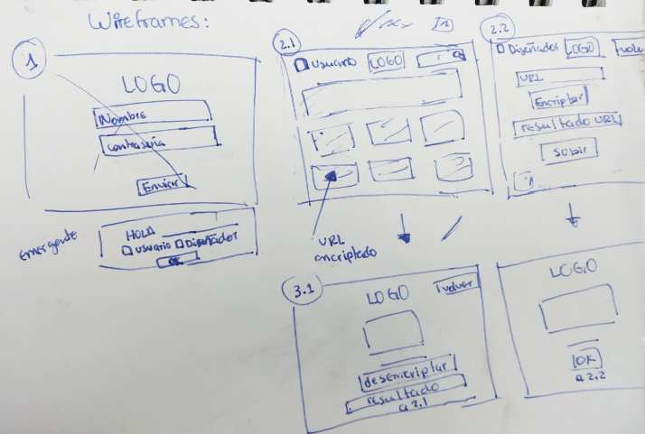
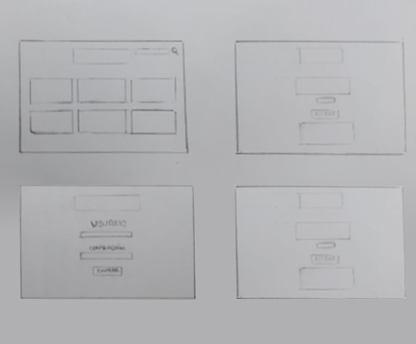

# Vectory

## Índice

* [1. Nombre del proyecto](#1-nombre-del-proyecto)
* [2. Resumen del proyecto](#2-resumen-del-proyecto)
* [3. Imagen del Proyecto](#3-imagen-del-proyecto)
* [4. Investigación UX](#4-investigación-ux)
* [5. Objetivos de aprendizaje](#5-objetivos-de-aprendizaje)

***

## 1. Nombre del proyecto

Vectory

## 2. Resumen del proyecto

Vectory es un motor de búsqueda que ayuda a los diseñadores gráficos y de web a localizar fotos de alta calidad, imágenes vectoriales, ilustraciones de artistas peruanos para sus proyectos creativos.

## 3. Imagen del proyecto

 
 
 
 

## 4. Investigación UX

#### * Usuarios y los objetivos en relación con el producto.
 Personas jovenes de entre 25 y 30 años, que se dedica a realizar trabajos en la industria de marketing, publicidad y diseño los cuales desea adquirir recursos gratuitos del mercado peruano para sus trabajos de una manera facil y rápida.

#### * Solución a los problemas/necesidades de dichos usuarios.
 Ante la constante informalidad en el sector peruano, se crea esta plataforma donde las personas podrán encontrar de manera gratuita. La única condición es atribuirlas al artisca peruan y asi medir la demanda de los mismos frente al mercado mundial, además de servir como plataforma para que más personas conoscan el trabajo peruano de manera legal y directa.

#### * Luego colocarás la foto de tu primer prototipo en papel.

 

#### * Feedback recibido indicando las mejoras a realizar.

 

#### * Imagen del prototipo final.
 

## 5. Objetivos de aprendizaje

### UX
​
- [x] Diseñar la aplicación pensando y entendiendo al usuario.
- [x] Crear prototipos para obtener feedback e iterar.
- [x] Aplicar los principios de diseño visual (contraste, alineación, jerarquía).
​
### HTML y CSS
​
- [x] Uso correcto de HTML semántico.
- [x] Uso de selectores de CSS.
- [x] Construir tu aplicación respetando el diseño realizado (maquetación).
​
### DOM
​
- [x] Uso de selectores del DOM.
- [x] Manejo de eventos del DOM.
- [x] Manipulación dinámica del DOM.
​
### Javascript
​
- [x] Manipulación de strings.
- [x] Uso de condicionales (if-else | switch).
- [ ] Uso de bucles (for | do-while).	
- [x] Uso de funciones (parámetros | argumentos | valor de retorno).
- [x] Declaración correcta de variables (const & let).
​
### Testing
- [ ] Testeo de tus funciones.
​
### Git y GitHub
- [x] Comandos de git (add | commit | pull | status | push).
- [x] Manejo de repositorios de GitHub (clone | fork | gh-pages).
​
### Buenas prácticas de desarrollo
- [ ] Uso de identificadores descriptivos (Nomenclatura | Semántica).
- [ ] Uso de linter para seguir buenas prácticas (ESLINT).

